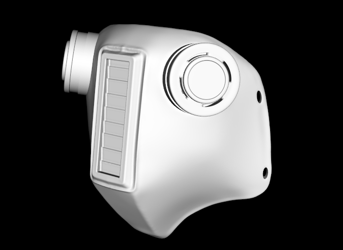
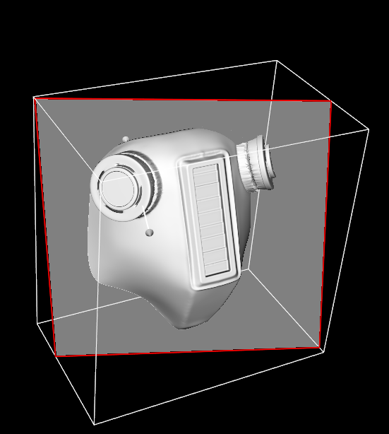
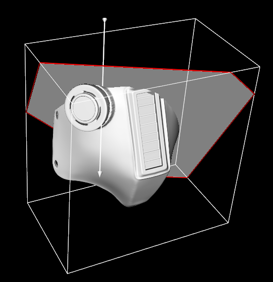

# Лабораторная работа #1

## Данные
Модель представляется в виде файла формата `.stl`.

## Фильтр
В качестве фильтра применялся `vtkSmoothPolyDataFilter`, который
корректирует координаты точки с помощью сглаживания Лапласа.

## Виджет
Выбран `vtkImplicitPlaneWidget`, который 
предназначен для интерактивного отсечения полигональных
данных плоскостью.

